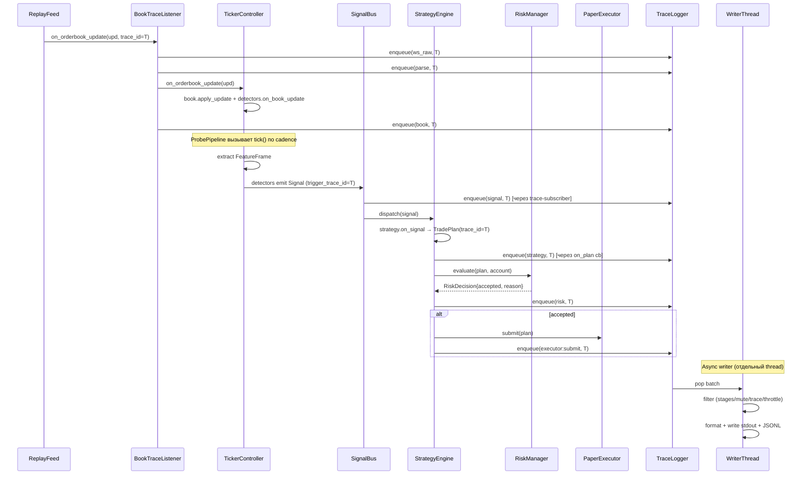

# План: core_probe — AI-friendly диагностический CLI для трассировки core/ и отслеживания ошибок

# core_probe — диагностический CLI для трассировки пайплайна `core/`

## 1. Problem & Context

Сегодня в проекте есть три CLI: основной `trade_bot` (file:core/src/main.cpp), `labeler` (file:core/tool/labeler/main.cpp) и `perf_replay` (file:core/tool/perf_replay/main.cpp). Ни один из них не подходит для **отслеживания ошибок и неточностей в логике пайплайна**:

- `trade_bot` запускает дашборд на порту 8080, metrics-сервер на 9090, MetaScalp discovery и пр. — он тяжёлый и спрятан за слоями оркестрации. Чтобы посмотреть, что происходит, приходится поднимать UI.
- `perf_replay` оптимизирован под измерение латенсий и использует *stub-стратегию* — реальные `SignalBus` / `StrategyEngine` / `RiskManager` через него не идут.
- `labeler` ждёт интерактивного ввода и трассирует только сигналы.

Кроме того, **ни один из них не пригоден для AI-агента**: дашборд требует браузер, остальные либо ждут интерактива (`labeler`), либо отдают только агрегаты в конце прогона (`perf_replay`). AI-агент не может сегодня самостоятельно: запустить пайплайн → прочитать машинный вывод → точно сказать, *где* и *почему* что-то пошло не так.

**Что строим:** отдельный CLI `core_probe` — read-only диагностический инструмент с двумя равноправными режимами:

1. **Human mode** — цветной текстовый stdout + JSONL-файл для пост-анализа человеком.
2. **Machine mode** (`--machine`) — first-class AI-friendly: чистый JSONL в stdout без цветов и спиннеров, self-describing schema, стабильный порядок полей, осмысленные exit codes, готовые «рецепты» для типовых вопросов.

Через оба режима **виден весь поток данных и обмен между компонентами** для одного `TraceId`-а: от сырого WS-сообщения до решения `RiskManager` и (если принято) до исполнения в `PaperExecutor`. Дополнительно — отдельный класс событий **`invariant`** активно ловит ошибки и неточности (битый orderbook, NaN в фичах, несвязный TradePlan, дрейф latency-бюджета и т.д.).

**Затрагивает:**

- **Разработчиков** — для пошаговой локализации багов без дашборда.
- **AI-агентов** (Claude/Cursor/etc.) — для автономной диагностики: "запусти core_probe на этом дампе и скажи, почему стратегия не вошла".

**Никакой связи с прод-данными, никаких реальных ордеров** (только `PaperExecutor`).

**Ключевые ограничения:**

- Принципиально без `LiveExecutor` / `OrderGateway` — `core_probe` пассивен.
- Не модифицирует существующий прод-код `core/src/` (только новые точки расширения, если потребуются — обратно совместимые).
- Подчиняется дисциплине проекта: hot-path discipline, lock-free очереди для логирования (см. `AGENTS.md § 2 Performance Engineering`).
- Логирование не должно искажать детерминизм replay (см. `AGENTS.md § 5 Determinism is Non-Negotiable`).

## 2. Technical Approach

### 2.1 Architectural Approach

#### Ключевые решения

| Решение | Обоснование |
| --- | --- |
| **Отдельный бинарник ****`core_probe`** в file:core/tool/core_probe/ по конвенции `labeler` / `perf_replay`. | Не трогает `trade_bot`, не тянет лишние зависимости (дашборд, OrderGateway). |
| **Подкоманды **`replay`** / **`live`** / **`synth`** / ****`diff`** через один бинарник. | Один help, общие флаги, общая инфраструктура трассировки. |
| **Сквозная связка событий по существующему ****`TraceId`** (file:core/src/perf/LatencyTracer.hpp, file:core/src/perf/TraceContext.hpp). | TraceId уже распространяется по пайплайну через `TraceContextScope` (TLS) и попадает в `Signal.trigger_trace_id` и `TradePlan.trace_id`. Идеальный идентификатор «одной транзакции». |
| **Переиспользование без модификаций**: `OrderBook`, `TradeStream`, `FeatureExtractor`, все детекторы, `StrategyEngine`, `RiskManager`, `PaperExecutor`, `SignalBus`, `ReplayFeed`, `MarketDataFeed`, `MetaScalpCodec`, `TickerController`, `Config`, `PerfRegistry`. | Никаких форков и копий — иначе расхождение прод/диагностика. |
| **Async-логирование трассировки**: события кладутся в lock-free `MpmcQueue<TraceEvent>`, отдельный writer-thread форматирует и пишет. | Соответствует дисциплине проекта. Не убивает производительность даже на BTC в live. |
| **Отдельный ****`TraceLogger`**, не смешанный с `trade_bot::Logger`. | Прод-логи (spdlog в `logs/trade_bot.log`) и trace-вывод не конфликтуют ни форматом, ни sink-ами. |
| **Два режима вывода**: **human mode** (по умолчанию) = цветной текст stdout + JSONL-файл; **machine mode** (`--machine`) = чистый JSONL stdout без цветов, без спиннеров, без summary-таблиц (summary тоже в JSONL). | Human-режим оптимизирован под глаза, machine-режим — под AI-агент или скрипт. AI читает прямо stdout одной командой `core_probe ... --machine`. |
| **Self-describing schema** (machine mode): первое событие в потоке — `{"stage":"meta","schema_version":"...","git_sha":"...","stages":{...}}` со списком стадий, их полей и типов. | AI-агенту не нужно знать схему заранее — она приходит с потоком. Schema эволюционирует с версией. |
| **Стадия ****`invariant`**** — first-class отлов ошибок/неточностей**: проверки выполняются на горячих точках (после `book.apply_update`, после `extract FeatureFrame`, после publish `Signal`, после `TradePlan` создан, после `RiskDecision`). Любое нарушение → событие `invariant` с `severity`, `code`, `hint`. | Главная цель пользователя — "отслеживание ошибок и неточностей". Инварианты автоматически ловят то, что человек/AI пропустил бы при ручном чтении лога. |
| **AI-рецепты ****`--ai-recipe <name>`** — готовые запросы поверх собранного JSONL: `why-no-trade`, `why-rejected`, `slow-stage`, `invariant-summary`, `signal-strategy-gap`. Каждый рецепт = детерминированный анализ JSONL → краткий машинный отчёт. | AI-агент задаёт вопрос одним флагом и получает структурированный ответ. Не нужно учить агента грепать JSONL вручную. |
| **Подкоманда ****`assert`** для пакетных проверок: `core_probe assert --dump X --expect "signals.DensityDetected >= 10"`. Exit code `0` если все expectations выполнены, `3` если нет. | AI-агент или CI могут писать тесты прямо командной строкой, без C++ test-fixture. |
| **Гибридный файловый вывод**: всегда пишется `logs/core_probe-<ts>.jsonl` (если не `--no-jsonl`). | Если AI запустил в `--machine` и потом захочет повторить анализ — JSONL уже на диске. |
| **Risk и Executor в полном объёме**: `RiskManager` со всеми R1..R15, `PaperExecutor` с виртуальным счётом. Плюс флаг `--risk-observe`, который логирует решения, но не блокирует план. | Видим всё, как в проде, плюс можем «протестировать без риск-фильтра». |
| **Конфигурация — только существующий** file:config/config.example.toml через `trade_bot::Config`. | Никаких параллельных конфигов. |
| **TickerMeta для live** — дефолтные значения (`price_increment=0.01`, `size_increment=1e-6`) или явные через флаги; никаких REST-вызовов в V1. | Минимум зависимостей, быстрая отладка. Discovery/REST на V2. |
| **Подкоманда ****`diff`** сравнивает два JSONL и подсвечивает расхождения по `(trace_id, stage, ticker, key fields)`. | Проверка детерминизма — краеугольный принцип проекта. |

#### Компромиссы / явные ограничения

- **`RiskManager.evaluate()`**** короткозамыкается** на первом нарушении (см. file:core/src/risk/RiskManager.cpp строки 32-345). Для отклонённых планов мы видим только **первую** сработавшую причину, не «какие правила прошли до неё». Принимаем как есть — `RiskManager` не модифицируем.
- **`PaperExecutor`** не имеет fill-callback — closed trades видны только через `pop_closed_trades()`, которое вызывается тиком. Закрытия логируем с небольшим запаздыванием — для отладки это нормально.
- **`--step`** (интерактивный пошаговый режим) — отложен на V2. В V1 хватит `--speed` и `--limit N`.

### 2.2 CLI Surface Design

#### Подкоманды

```text
core_probe replay  --dump <ndjson> --ticker T[,T...] [common flags]
core_probe live    --ws-url <url>  --ticker T[,T...] [common flags]
core_probe synth   --scenario <name>                 [common flags]
core_probe diff    --left <jsonl1> --right <jsonl2>  [--keys ...]
core_probe assert  --dump <ndjson> --ticker T --expect EXPR[,EXPR...]
core_probe schema                                    # печатает JSON-схему всех стадий и выходит
```

#### Общие флаги

| Категория | Флаг | Описание |
| --- | --- | --- |
| **Конфиг** | `--config <path>` | По умолчанию `config.toml`; переопределяет дефолты для детекторов/стратегий/риска. |
| **Пайплайн** | `--detectors d1,d2,...` | Включить только указанные (`density,iceberg,tape,level,approach,leader`). По умолчанию — все. |
|  | `--strategies s1,s2,...` | Включить только указанные (`bounce,breakout,leaderlag,flush`). По умолчанию — все. |
|  | `--no-strategy` | Не подключать стратегии (останов на `SignalBus`). |
|  | `--no-risk` | Не подключать риск (план идёт сразу в executor). |
|  | `--no-executor` | Не подключать executor (останов на `TradePlan`). |
|  | `--risk-observe` | Risk логирует решения, но не блокирует план. |
| **Фильтры** | `--stages s1,s2,...` | Логировать только перечисленные стадии. |
|  | `--mute s1,s2,...` | Заглушить указанные (например, `book,trades`). |
|  | `--trace <id>` | Показать только события с конкретным `trace_id`. |
|  | `--throttle-book <Nms>` | OrderBook updates — не чаще 1 раза в N мс на тикер. |
|  | `--quiet` | Профиль по умолчанию: `signal+strategy+risk+executor+account+summary`. |
|  | `--verbose` | Всё, включая `ws_raw` и каждый trade. |
| **Вывод** | `--machine` | AI-friendly: JSONL в stdout, без цветов, без таблиц, summary тоже в JSONL. Подразумевает `--no-color`. Подходит для `subprocess.run(...).stdout` в AI-агенте. |
|  | `--no-color` | Отключить ANSI-цвета (для CI/файла). |
|  | `--jsonl-out <path>` | Куда писать JSONL-файл (по умолчанию `logs/core_probe-<ts>.jsonl`). |
|  | `--no-jsonl` | Не писать JSONL-файл. |
|  | `--no-stdout` | Не писать в stdout (только в файл). |
|  | `--include-payload` | В JSONL включать полный `SignalPayload`/`FeatureFrame` (по умолчанию ключевые поля). |
| **AI-помощь** | `--ai-recipe <name>` | Запустить готовый рецепт анализа после прогона: `why-no-trade`, `why-rejected`, `slow-stage`, `invariant-summary`, `signal-strategy-gap`. Печатает JSON-отчёт в stdout. |
|  | `--ai-recipe-arg key=value` | Параметры рецепта (например, `strategy=bounce`, `ticker=BTC_USDT`). Можно повторять. |
| **Инварианты** | `--invariants on\|off\|strict` | `on` (по умолчанию) = инварианты проверяются и эмитятся как события; `strict` = первое нарушение завершает прогон с exit code `4`; `off` = выключить. |
|  | `--invariant-set s1,s2,...` | Включить только указанные группы (`book`, `features`, `signals`, `plans`, `risk`, `executor`, `latency`). По умолчанию — все. |
| **Replay-специфика** | `--speed <float>` | `0.0` = as-fast-as-possible (по умолчанию), `1.0` = real-time, `2.0` = ×2. |
|  | `--limit <N>` | Остановиться после N сообщений. |
|  | `--start-ts <iso8601>` | Skip до указанной метки. |
| **Account (paper)** | `--equity-usd <amount>` | Начальный капитал виртуального счёта (по умолчанию `100000`). |
| **Прочее** | `--list-stages` | Печатает доступные имена стадий и выходит. |
|  | `--version` | Версия и git-хэш. |
|  | `--help` / `subcommand --help` | Стандартный help. |

#### Стадии трассировки (canonical names)

```text
meta            — первое событие в machine-режиме: schema, git_sha, config_path
ws_raw          — сырое WS-сообщение / строка NDJSON
parse           — результат MetaScalpCodec (тип события, тикер)
book            — apply_snapshot / apply_update + резюме mid/spread/imbalance
trades          — каждый принт (или сводка с throttle)
features        — поля FeatureFrame (mid, spread_bps, vol, imbalance, корреляция и т.д.)
signal          — публикация в SignalBus (kind + полный SignalPayload)
strategy        — вход в IStrategy::on_signal/on_frame/tick, эмиссия TradePlan
risk            — RiskDecision: accepted / rejected + RejectReason + details
executor        — submit, fill, cancel, reject, close_trade
account         — изменения equity / free_balance / position open/close / realized_pnl
invariant       — нарушение инварианта (битый book, NaN, latency budget exceeded и т.д.)
error           — исключение/неожиданная ошибка (поймано `try/catch` в ProbePipeline)
perf            — итоговые гистограммы по стадиям (в summary)
summary         — финальный агрегат: счётчики, PnL, latency (в machine-режиме = JSONL)
```

#### Инварианты (что именно проверяется в стадии `invariant`)

| Группа | Инвариант | Когда триггерится | `code` |
| --- | --- | --- | --- |
| `book` | `best_bid < best_ask` | После `OrderBook::apply_update` | `BOOK_CROSSED` |
| `book` | все sizes ≥ 0 | После apply | `BOOK_NEGATIVE_SIZE` |
| `book` | `mid > 0` если есть оба best | После apply | `BOOK_MID_INVALID` |
| `book` | spread_bps в разумных пределах (≤ 1000) | После apply | `BOOK_SPREAD_HUGE` |
| `features` | нет NaN/Inf в полях `FeatureFrame` | После `extract` | `FEATURES_NAN` |
| `features` | `timestamp` монотонен | После `extract` | `FEATURES_TIME_REGRESSION` |
| `signals` | `confidence ∈ [0, 1]` | При publish в `SignalBus` | `SIGNAL_CONFIDENCE_OOR` |
| `signals` | `price > 0` если кинд требует цены | При publish | `SIGNAL_PRICE_INVALID` |
| `signals` | `trigger_trace_id != 0` для сигналов, рождённых из WS-события | При publish | `SIGNAL_NO_TRACE` |
| `plans` | `stop_price` на правильной стороне от `entry_price` | При эмиссии `TradePlan` | `PLAN_STOP_WRONG_SIDE` |
| `plans` | `tp1_price` на правильной стороне | При эмиссии | `PLAN_TP_WRONG_SIDE` |
| `plans` | `stop_price > 0`, `entry_price > 0` | При эмиссии | `PLAN_PRICE_INVALID` |
| `plans` | `trace_id != 0` | При эмиссии | `PLAN_NO_TRACE` |
| `risk` | `RejectReason` совместим со стадией (например, `KillSwitchActive` → `accepted=false`) | После `evaluate` | `RISK_DECISION_INCONSISTENT` |
| `executor` | для каждого `submit` ≤ одно `close` (нет двойного закрытия) | При close | `EXECUTOR_DOUBLE_CLOSE` |
| `executor` | `unrealized_pnl` ≠ NaN | При расчёте | `EXECUTOR_NAN_PNL` |
| `account` | `equity_usd` не уходит ниже 0 (paper-режим) | После закрытия | `ACCOUNT_NEGATIVE_EQUITY` |
| `latency` | стадия превысила бюджет (configurable, дефолт p99 < SLO из `AGENTS.md` × 4) | После `summary` | `LATENCY_BUDGET_EXCEEDED` |

Каждое `invariant`-событие содержит поле `hint` — короткая подсказка для AI/разработчика, где смотреть: `"Check OrderBook::apply_update — best_bid >= best_ask after apply"`.

#### Подкоманда `assert` — DSL ожиданий

Грамматика выражения (одно `--expect` = одно выражение):

```text
<path>          ::= identifier ( '.' identifier )*
<op>            ::= '==' | '!=' | '>=' | '<=' | '>' | '<'
<expectation>   ::= <path> <op> <number>

Примеры:
  --expect "signals.DensityDetected >= 10"
  --expect "risk.rejected.DailyLossLimitHit == 0"
  --expect "invariants.total == 0"
  --expect "executor.realized_pnl_usd > 0"
  --expect "latency.end_to_end_book_to_submit_us.p99 < 1000"
```

Exit codes для `assert`: `0` все выполнены, `3` нарушения ожиданий, `1` ошибка парсинга выражения.

#### Формат вывода (примеры)

**Stdout — human mode (по умолчанию):**

```text
[15:32:01.234] [trace=0000042] [BTC_USDT] [ws_raw   ] orderbook_update 8 levels
[15:32:01.234] [trace=0000042] [BTC_USDT] [parse    ] orderbook_update parsed in 18us
[15:32:01.234] [trace=0000042] [BTC_USDT] [book     ] mid=77396.05 spread_bps=0.13 imbalance=+0.12 (Δlevels=8)
[15:32:01.235] [trace=0000042] [BTC_USDT] [features ] vol_1s=0.04% prints_5s=42 leader_corr_60s=0.71
[15:32:01.235] [trace=0000042] [BTC_USDT] [signal   ] DensityDetected price=77394.9 size_usd=200032 conf=0.85 side=Bid
[15:32:01.235] [trace=0000042] [BTC_USDT] [strategy ] BounceFromDensity → TradePlan side=Buy entry=77395.2 stop=77392.0 tp1=77400.4
[15:32:01.236] [trace=0000042] [BTC_USDT] [risk     ] REJECT DailyLossLimitHit: "Daily loss limit hit: -3.2%"
[15:32:01.789] [trace=0000043] [ETH_USDT] [invariant] [WARN] BOOK_CROSSED best_bid=2480.5 >= best_ask=2480.4 — hint: Check OrderBook::apply_update for ETH_USDT
```

**Stdout — machine mode (****`--machine`****):**

```jsonl
{"stage":"meta","schema_version":"1.0","core_probe_version":"0.0.1","git_sha":"abc1234","config":"config.toml","started_at_ns":1729520...,"stages":["ws_raw","parse","book",...]}
{"stage":"book","ts_ns":1729520...,"trace_id":42,"ticker":"BTC_USDT","mid":77396.05,"spread_bps":0.13,"imbalance":0.12,"delta_levels":8}
{"stage":"signal","ts_ns":1729520...,"trace_id":42,"ticker":"BTC_USDT","kind":"DensityDetected","price":77394.9,"size_usd":200032.0,"confidence":0.85,"side":"Bid"}
{"stage":"strategy","ts_ns":1729520...,"trace_id":42,"ticker":"BTC_USDT","strategy":"BounceFromDensity","side":"Buy","entry_price":77395.2,"stop_price":77392.0,"tp1_price":77400.4}
{"stage":"risk","ts_ns":1729520...,"trace_id":42,"ticker":"BTC_USDT","accepted":false,"reason":"DailyLossLimitHit","details":"Daily loss limit hit: -3.2%"}
{"stage":"invariant","ts_ns":1729520...,"trace_id":43,"ticker":"ETH_USDT","severity":"warn","code":"BOOK_CROSSED","message":"best_bid >= best_ask","details":{"best_bid":2480.5,"best_ask":2480.4},"hint":"Check OrderBook::apply_update for ETH_USDT"}
{"stage":"summary","messages_parsed":8147,"messages_dropped":0,"signals":{"DensityDetected":127,...},"plans":{"generated":51,"accepted":12,"rejected":{"DailyLossLimitHit":10,...}},"invariants":{"total":3,"by_code":{"BOOK_CROSSED":2,"FEATURES_NAN":1}},"executor":{"submitted":12,"closed":11,"realized_pnl_usd":234.5},"latency_us":{"end_to_end_book_to_submit":{"p50":102,"p99":912,"max":3504}}}
```

**AI-recipe вывод (всегда чистый JSON, и в human, и в machine):**

```bash
$ core_probe replay --dump X.ndjson --ticker BTC_USDT --ai-recipe why-no-trade --ai-recipe-arg strategy=bounce
```

```json
{
  "recipe": "why-no-trade",
  "strategy": "BounceFromDensity",
  "ticker": "BTC_USDT",
  "plans_generated": 8,
  "plans_accepted": 0,
  "top_reject_reasons": [
    {"reason": "StopTooWide",      "count": 5, "sample_trace_ids": [42, 67, 88]},
    {"reason": "NotInUniverse",    "count": 2, "sample_trace_ids": [101, 156]},
    {"reason": "FundingBlackout",  "count": 1, "sample_trace_ids": [203]}
  ],
  "hint": "Most rejections are StopTooWide. Check BounceFromDensity stop calculation — current avg stop_dist_bps is 28.4, max allowed is 20."
}
```

**Итоговая сводка ****`=== Summary ===`****:**

```text
=== Summary ===
Source:      replay file=replay/dumps/dump_2026-05-18T12-16-29.ndjson
Duration:    312s of market time, 4.2s wall time (×74.3 faster than realtime)
Messages:    8147 parsed, 3 parse errors, 0 dropped

Signals by kind:
  DensityDetected      127
  IcebergSuspected       8
  TapeBurst             34
  LevelFormed            5
  LevelApproach         42
  LeaderMove            19

Plans:
  Generated by strategy:
    BounceFromDensity     31
    BreakoutEatThrough    14
    LeaderLag              6
  Risk decisions:
    Accepted              12
    Rejected              39
      StopTooWide          14
      DailyLossLimitHit    10
      NotInUniverse         8
      FundingBlackout       4
      InsufficientMargin    3

Executor (paper):
  Submitted              12
  Closed                 11
  Open at end             1
  Realized PnL          +234.50 USD
  Unrealized PnL         -12.30 USD

Latency (us):
  codec_to_book_apply          p50=  18  p99=  142  max=  890
  book_to_feature              p50=  23  p99=  201  max= 1240
  density_eval                 p50=   8  p99=   42  max=  198
  signal_to_plan               p50=  41  p99=  389  max= 2104
  plan_to_risk                 p50=  12  p99=   88  max=  445
  risk_to_submit               p50=   6  p99=   34  max=  201
  end_to_end_book_to_submit    p50= 102  p99=  912  max= 3504
```

#### Exit codes

| Код | Значение |
| --- | --- |
| `0` | Успех (для `diff` — нет расхождений; для `assert` — все expectations выполнены) |
| `1` | Ошибка парсинга / конфига / аргументов |
| `2` | `diff` нашёл расхождения |
| `3` | `assert` — одно или более expectations не выполнено |
| `4` | `--invariants strict` — нарушен инвариант, прогон прерван |
| `42` | `KillSwitch` сработал во время прогона |

### 2.3 Component Architecture

#### Новые компоненты (все в file:core/tool/core_probe/)

| Компонент | Ответственность |
| --- | --- |
| `main.cpp` | Точка входа: парсит подкоманду и общие флаги, вызывает соответствующий runner. |
| `CliOptions` | Парсер аргументов (всех флагов из § 2.2). Валидирует комбинации (`--no-risk` + `--no-executor` и т.п.). |
| `TraceEvent` (POD) | Запись одной стадии трассировки: `{ts_ns, trace_id, stage, ticker, severity, payload (typed union)}`. |
| `TraceLogger` | Async-логгер: `enqueue(TraceEvent&&)` (lock-free, hot-path-safe) + writer-thread, который форматирует и пишет в stdout + JSONL. Фильтры (`--stages`, `--mute`, `--trace`, `--throttle-book`) применяются в writer-thread. |
| `TraceFormatter` | Форматирование `TraceEvent` → текст (с ANSI-цветом, опциональным) или JSONL. |
| `TraceJsonlSink` | Буферизованная запись JSONL в файл, flush по таймеру. |
| `SummaryCollector` | Накапливает агрегаты (счётчики сигналов/планов/risk-причин, PnL) для финального `=== Summary ===`. |
| `ProbePipeline` | «Сборщик» пайплайна: создаёт `TickerController` для каждого тикера (с подсаженными trace-hook'ами), `SignalBus`, `StrategyEngine`, `RiskManager`, `PaperExecutor`, `TickerUniverse`. Подписывает trace-hook'и на нужные точки. |
| `ReplayRunner` | `subcommand replay`: создаёт `ReplayFeed`, подключает к `ProbePipeline`, прокручивает дамп. |
| `LiveRunner` | `subcommand live`: создаёт `BeastWsClient`, оборачивает в `MarketDataFeed`, подключает к `ProbePipeline`. Минимальный bootstrap: явные тикеры из CLI, дефолтные `TickerMeta`. |
| `SyntheticFeed` + `SyntheticScenarios` | `subcommand synth`: генератор `OrderBookUpdate` / `Trade` событий по 3 хардкод-сценариям (`density_appears`, `density_eaten_then_breakout`, `leader_moves_alt_lags`). Реализует тот же интерфейс, что `ReplayFeed` (fanout по `IMarketDataListener`). |
| `DiffRunner` | `subcommand diff`: читает 2 JSONL, индексирует по `(trace_id, stage, ticker)`, сравнивает по списку «ключевых» полей (whitelisted per stage), печатает diff. |
| `AssertRunner` | `subcommand assert`: оборачивает `ReplayRunner`, после прогона проходит по всем `--expect` выражениям против `SummaryCollector` агрегатов, печатает результат, exit code `0` или `3`. |
| `SchemaRunner` | `subcommand schema`: печатает JSON-схему всех стадий и их полей. Та же схема, что в `meta`-событии. |
| `InvariantChecker` | Набор predicate-функций по группам (`book`, `features`, `signals`, `plans`, `risk`, `executor`, `latency`). Вызывается из соответствующих `StageHooks` после каждого «горячего» события. При нарушении эмитит `invariant`-событие с `code` + `hint`. Поддерживает `strict` режим (первое нарушение → exit 4). |
| `AiRecipeRunner` | Реализация рецептов `why-no-trade`, `why-rejected`, `slow-stage`, `invariant-summary`, `signal-strategy-gap`. Каждый рецепт = детерминированный анализ in-memory агрегатов `SummaryCollector` + при необходимости second pass по JSONL-файлу. Выход — чистый JSON в stdout. |
| `MachineModeFormatter` | Альтернативный форматтер: вместо текстовых строк — JSONL с детерминированным порядком полей (`stage`, `ts_ns`, `trace_id`, `ticker`, остальные поля в алфавитном порядке). Без ANSI-кодов. |
| `StageHooks` | Набор thin-adapter'ов, которые подписываются на существующие callback-точки (`SignalBus::subscribe`, `StrategyEngine::set_on_plan`, `StrategyEngine::set_close_callback`, `PaperExecutor::pop_closed_trades` опросом из тика) и эмитят `TraceEvent` в `TraceLogger`. Эти же hooks триггерят `InvariantChecker`. |
| `BookTraceListener` | Реализует `IMarketDataListener`: оборачивает целевой `TickerController`, перехватывает `on_orderbook_*` / `on_trade(s)` / `on_trade` для эмиссии `ws_raw` + `parse` + `book` + `trades`. Делегирует фактическую работу `TickerController`-у. После каждого `apply` дёргает `InvariantChecker.check_book`. |

#### Интеграция с существующими компонентами (точки расширения, без модификации прод-кода)

| Стадия | Куда подключаемся | Как |
| --- | --- | --- |
| `ws_raw` | `BeastWsClient::set_on_raw_message` (live) или сырая строка NDJSON (replay/synth) | Уже существующий хук в file:core/src/transport/BeastWsClient.hpp. |
| `parse` | Замеряется обёрткой вокруг `MetaScalpCodec::parse_*` — внутри `BookTraceListener` | Метрика — `record_delta_us`, как в `LatencyTracer`. |
| `book`, `trades` | `BookTraceListener` (новый `IMarketDataListener`-декоратор перед `TickerController`) | `MarketDataFeed::add_listener(ticker, &BookTraceListener)` + регистрация `TickerController` отдельным listener'ом или цепочкой. |
| `features` | После `TickerController::tick()` (он возвращает `FeatureFrame`) | `ProbePipeline` сам вызывает `tick()` и логирует возвращённый frame. |
| `signal` | `SignalBus::subscribe(...)` | `SignalBus` уже поддерживает несколько подписчиков; добавляем trace-подписчика **первым**, чтобы видеть сигнал до того, как стратегии на него отреагируют. |
| `strategy` | `StrategyEngine::set_on_plan(cb)` + `StrategyEngine::set_close_callback(cb)` | Уже существующие хуки. |
| `risk` | Обёртка `Risk evaluator`-вызова в `set_on_plan`: вызываем `risk.evaluate(plan, account)`, логируем `RiskDecision`, при `accepted` (или `--risk-observe`) идём дальше в executor. | Полностью соответствует тому, как делает `perf_replay`. |
| `executor` | После `paper.submit(plan)` логируем submit; периодически вызываем `paper.pop_closed_trades()` — каждое закрытие = `executor` событие. | `PaperExecutor` уже даёт `pop_closed_trades()`. |
| `account` | После каждого `closed_trade` обновляем `AccountState` (Kahan-аккумулятор для `realized_pnl`) и эмитим `account` событие. | Используем `KahanAccumulator` (file:core/src/numeric/Kahan.hpp) — как в `BotApp`. |
| `perf` | `PerfRegistry::instance().render_text_report()` в самом конце. | Уже существует. |

#### Диаграмма потока (одно WS-сообщение в replay-режиме)



#### Поток подкоманды `diff`

`diff` читает два JSONL → строит для каждого индекс `Map<(trace_id, stage, ticker) → Event>` → итерирует объединение ключей → сравнивает только **whitelisted** поля per stage (например, для `book` — `mid` и `spread_bps`; для `risk` — `accepted` и `reason`; для `executor` — `entry_price`, `size_filled`, `pnl_usd`). Печатает в формате `UNIFIED-DIFF-like`. Exit code `0` (одинаковы) / `2` (расхождения).

### 2.4 Зависимости сборки

В file:core/CMakeLists.txt добавляется `add_executable(core_probe ...)` с теми же `obj_*` библиотеками, что `perf_replay`, плюс источники, которых нет в `perf_replay`:

- те же object-библиотеки (`obj_logger`, `obj_codec`, `obj_orderbook`, `obj_trade_stream`, `obj_signal_bus`, и т.д.);
- плюс `IcebergDetector.cpp`, `ApproachAnalyzer.cpp` (уже в `perf_replay`);
- плюс `BeastWsClient.cpp` + `MarketDataFeed.cpp` (для live);
- свои файлы: `tool/core_probe/main.cpp`, `CliOptions.cpp`, `TraceLogger.cpp`, `TraceFormatter.cpp`, `MachineModeFormatter.cpp`, `ProbePipeline.cpp`, `InvariantChecker.cpp`, `AiRecipeRunner.cpp`, `AssertRunner.cpp`, `SchemaRunner.cpp`, `ReplayRunner.cpp`, `LiveRunner.cpp`, `SyntheticFeed.cpp`, `DiffRunner.cpp`, `SummaryCollector.cpp`.

В file:scripts/build.sh добавить `show_bin core_probe "core_probe (pipeline tracer + AI probe)"` в финальный summary.

### 2.5 AI Usage Examples

Цель — чтобы любой AI-агент (включая будущие сессии Claude/Cursor в этом репозитории) мог одной командой получить структурированный ответ.

#### Кейс 1: «Почему стратегия не делает сделок?»

```bash
core_probe replay --dump replay/dumps/D.ndjson --ticker BTC_USDT \
  --ai-recipe why-no-trade --ai-recipe-arg strategy=bounce --machine
```

AI получает JSON с разбивкой `plans_generated → plans_accepted` и топ-причинами reject. На основе `hint` понимает следующий шаг диагностики.

#### Кейс 2: «Есть ли битые orderbook'и в продовом дампе?»

```bash
core_probe replay --dump replay/dumps/D.ndjson --ticker BTC_USDT,ETH_USDT \
  --invariant-set book --machine | jq -c 'select(.stage=="invariant")'
```

AI стримит только нарушения book-инвариантов с trace_id, по которому можно найти соответствующее WS-сообщение.

#### Кейс 3: «Latency не вышла за бюджет?»

```bash
core_probe assert --dump replay/dumps/D.ndjson --ticker BTC_USDT \
  --expect "latency.end_to_end_book_to_submit_us.p99 < 25000" \
  --expect "invariants.total == 0"
```

Exit code `0` = ок, `3` = нарушение бюджета или инварианта. Идеально для CI и для AI-вопроса «всё ли хорошо?».

#### Кейс 4: «Сравни два прогона на детерминизм»

```bash
core_probe replay --dump D.ndjson --ticker BTC --jsonl-out /tmp/run1.jsonl --no-stdout
core_probe replay --dump D.ndjson --ticker BTC --jsonl-out /tmp/run2.jsonl --no-stdout
core_probe diff --left /tmp/run1.jsonl --right /tmp/run2.jsonl --machine
```

AI читает diff-репорт в JSON, точно знает, в какой стадии и поле появилось расхождение.

## 3. Failure Modes & Edge Cases

| Сценарий | Поведение |
| --- | --- |
| Дамп NDJSON содержит битую строку | Считаем как `parse_error`, инкрементируем счётчик, продолжаем. В summary показываем итог. (Так уже делает `ReplayFeed`.) |
| Live-режим: WS обрывается | `BeastWsClient` сам реконнектится с back-off. Эмитим `error` событие с серьёзностью WARN. |
| Очередь `MpmcQueue<TraceEvent>` переполнена | Hot-path не блокируется; событие *теряется*, инкрементируем `dropped_events`. В summary — `dropped: N`. (Лучше потерять trace, чем затормозить пайплайн.) Если `dropped > 0` — эмитим `invariant` событие с `code=TRACE_QUEUE_OVERFLOW`. |
| `KillSwitch` триггерится во время прогона | Финализируем JSONL (flush), пишем summary, выходим с кодом `42`. |
| Тикер пришёл с WS, но отсутствует в `--ticker` фильтре | Тихо игнорируем на входе (до `BookTraceListener`). |
| `--trace <id>` указан, но событий с таким ID нет | Прогон проходит без вывода в stdout (JSONL тоже почти пустой). Summary всё равно покажет общие счётчики. |
| Конфиг `config.toml` отсутствует | Используем дефолты из существующих `Config::get_or<T>` (вся кодовая база уже к этому готова). Печатаем WARN в начале. В machine-режиме — `meta`-событие с `config_loaded=false`. |
| Replay-дамп содержит только `mark_price_update` (без book/trades) | OK: пайплайн ничего не считает, summary покажет 0 сигналов. |
| `IStrategy::tick` бросает исключение | Ловим в `ProbePipeline`, эмитим `error` событие с типом исключения и стек-трейсом (если доступен), продолжаем (как делает прод). В `strict` режиме — exit code `4`. |
| `--diff` — JSONL отличаются количеством событий | Считаем «лишние» события как «extra in left/right», показываем первые N в diff-отчёте. |
| `--diff` — поля типа `risk_usd` отличаются на 1e-12 (плавающая точка) | Применяем `epsilon=1e-9` по конфигу. |
| `--assert` выражение синтаксически некорректно | Exit code `1` с диагностикой: "unknown path 'signals.NonExistentKind'" или "expected number after '>='". |
| `--ai-recipe` неизвестное имя | Exit code `1`, печатает список доступных рецептов. |
| `--machine` + `--no-jsonl` + `--no-stdout` | Exit code `1` — нечего писать. |
| Инвариант `BOOK_CROSSED` сработал в `strict` режиме | Финализируем, пишем summary с `invariant.code` и `trace_id`, exit `4`. |

## 4. Out of Scope (V2+)

Чтобы держать V1 фокусированным:

- **`--step`**** (интерактивный пошаговый режим).**
- **Live-режим с полным bootstrap'ом** (MetaScalp discovery, REST tickers metadata, cluster snapshots, universe pool).
- **DSL для ****`synth`****-сценариев** (TOML/YAML). В V1 — 3 хардкод-сценария.
- **Replay через ****`simdjson`** (V1 переиспользует существующий `ReplayFeed` с `nlohmann_json`).
- **TUI с панелями** (ncurses). Только stdout + JSONL.
- **HTTP/Prometheus-эндпоинт** трассировки. Только файл/stdout.
- **LLM-генерация hint'ов** для инвариантов на основе кода. В V1 — статические hint-строки в коде проверок.
- **`--ai-recipe natural-language`** (свободный вопрос). В V1 — только фиксированный набор рецептов.

## 5. Acceptance Criteria (V1)

1. **Бинарник собирается**: `./scripts/build.sh release --target core_probe` создаёт `build/release/bin/core_probe`. Сборка не ломает существующие `trade_bot`, `labeler`, `perf_replay`.
2. **Replay работает end-to-end** (human mode):
     ```bash
         core_probe replay --dump replay/dumps/dump_2026-05-18T12-16-29.ndjson --ticker BTC_USDT --quiet
     ```
  - в stdout видны строки стадий `signal/strategy/risk/executor` с одинаковым `trace_id` для одной цепочки;
  - JSONL-файл создан в `logs/`;
  - в конце напечатан `=== Summary ===` со счётчиками и latency-репортом.
3. **Machine mode работает**:
     ```bash
         core_probe replay --dump X --ticker BTC_USDT --machine | head -1 | jq .stage
     ```
  - первое событие — `"meta"` с `schema_version`, `git_sha`, `stages`;
  - каждая последующая строка — валидный JSON с обязательным полем `stage`;
  - последнее событие — `"summary"` с агрегатами;
  - **никакого** не-JSON вывода в stdout.
4. **Live работает на одном тикере** против реального MetaScalp без отправки ордеров, держит стабильный поток ≥30 секунд, без падений и без переполнения очереди (или с явным `dropped_events: 0` при разумной нагрузке).
5. **Synth-сценарий ****`density_eaten_then_breakout`** воспроизводимо генерирует ожидаемый набор сигналов: `DensityDetected → DensityEating → LevelBreak`. Эта проверка кодифицируется в `core/test/integration/core_probe_synth_test.cpp`.
6. **Detector toggle**: `core_probe replay ... --detectors density,level` логирует сигналы только этих двух типов.
7. **Risk reject visibility**: при `--risk-observe` событий `risk` строго столько же, сколько событий `strategy`. Без флага — план, на котором сработало правило R1..R15, виден в `executor`-стадии только если `accepted=true`.
8. **Инварианты работают**:
  - намеренно подменённый orderbook (best_bid > best_ask) в дампе → событие `invariant` с `code=BOOK_CROSSED` + `hint`;
  - в `strict` режиме тот же случай → exit code `4`;
  - чистый дамп → `invariants.total == 0` в summary.
9. **`assert`**** подкоманда работает**:
  - `core_probe assert --dump X --expect "signals.DensityDetected >= 1"` на дампе с плотностями → exit `0`;
  - то же выражение на пустом дампе → exit `3`;
  - синтаксически битое выражение → exit `1` с диагностикой.
10. **AI-рецепт ****`why-no-trade`** на дампе с заведомо отклонёнными планами возвращает валидный JSON с непустым `top_reject_reasons`.
11. **`diff`**** детектирует расхождения**: два запуска одного и того же дампа с одинаковыми параметрами дают `exit 0`; намеренная подмена одного `OrderBookUpdate` → `exit 2` с осмысленным diff-отчётом.
12. **`schema`**** подкоманда**: `core_probe schema | jq .stages.signal.fields` возвращает список полей стадии `signal`.
13. **Документация**: `core/tool/core_probe/README.md` с примерами запуска и описанием каждой стадии. Два раздела:
  - **«Recipes for humans»**: «как найти, почему стратегия не вошла», «как найти причину reject от Risk», «как сверить два прогона».
  - **«Recipes for AI agents»**: как вызывать `--machine`, как читать `meta`-схему, как использовать `--ai-recipe` и `assert`, exit code semantics.
14. **CI smoke** (опционально, на ваш выбор): `scripts/test.sh` запускает `core_probe replay --machine --limit 500` на маленьком фикстуре и проверяет валидность JSONL + ненулевое число сгенерированных сигналов через `assert`.